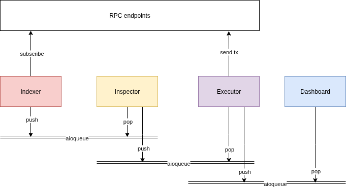

# Ethereum Snipe bot
Sniper bot for Ethereum for fun and profit.

## Architecture



## Prerequisites

- [Python 3.11](https://www.python.org/downloads/release/python-3110/)
- [Foundry](https://book.getfoundry.sh/getting-started/installation)
- [PyREVM](https://github.com/0xbarchitect/pyrevm)
- [Postgresql v15](https://hub.docker.com/_/postgres)

## Setup

- Install dependencies
```bash
$ pip install -r requirements.txt
```

- Install [pyrevm](./pyrevm/README.md)

- Create .env file from template and populate necessary credentials and secrets.
```bash
$ cp .env.example .env
```

## Migrate 

- Execute DB migrations
```bash
$ python manage.py migrate
```

## Run

- Start bot
```bash
$ python main.py
```